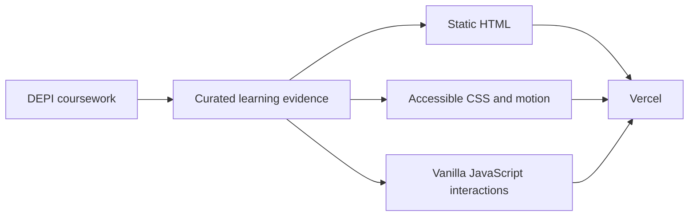

<p align="center">
  
</p>

# DEPI Learning Journey

An evidence-based website documenting what I learned through the Digital Egypt Pioneers Initiative: Python foundations, API ingestion, pandas, SQL, browser automation, Flask, and the process of turning notebook exercises into tested software.

<p align="center">
  <a href="https://depi-tasks-pi.vercel.app/">Live website</a> ·
  <a href="https://github.com/HassanG04/DEPI_TASKS">GitHub repository</a>
</p>

The site borrows the visual language and motion principles of my portfolio—glass surfaces, gradient accents, reveal animations, counters, a particle background, light/dark themes, and reduced-motion support—while using a separate DEPI identity and content structure.

## What this repository contains

| Area | Evidence | Status |
|---|---|---|
| Python foundations | `learning/python/python_foundations.ipynb` | Coursework covering control flow, collections, functions, modules, and OOP |
| Advanced Python and APIs | `learning/advanced-python/weather_etl.ipynb` | Secure weather-ingestion prototype using an environment variable |
| Pandas and analytics | `assignment panda/assignment.ipynb` | Original supermarket profiling, cleaning, feature engineering, and analysis |
| Data engineering | `src/supermarket_etl/` | Reusable validated ETL, reject handling, reconciliation, CLI, tests, and CI |
| SQL Server | `learning/sql/banking_queries.sql` | CTEs, ranking windows, joins, date/null/string functions, and user-defined functions |
| Flask | `learning/flask/flask_intro.ipynb` | Introductory route and template-rendering exercise |
| Web scraping | Documented on the site | Early Selenium exercises; not presented as a production scraper |

## Website architecture



The website is intentionally static. It needs no database or server-side framework: its job is to present verified learning evidence quickly, securely, and inexpensively.

## Run the website locally

From the repository root:

```bash
python -m http.server 8000
```

Open `http://localhost:8000`.

## Run the ETL and tests

```bash
python -m venv .venv
# Windows: .venv\Scripts\activate
# Linux/macOS: source .venv/bin/activate
python -m pip install -e ".[dev]"
pytest -q
ruff check src tests
ruff format --check src tests
```

The current supermarket pipeline remains the strongest engineered artifact. On the committed teaching dataset, its verified run processed 1,014 rows: 959 accepted, 55 rejected, 14 duplicate invoices, 24 reconstructed unit prices, and zero revenue-reconciliation failures. These are dataset measurements, not production-usage claims.

## Weather notebook security

The original local training notebook contained a real-looking OpenWeatherMap API key and a shared classroom SQL password. Neither credential is published here.

The cleaned notebook expects:

```bash
OPENWEATHER_API_KEY=replace_with_your_own_key
```

Copy `.env.example` to your local secret-management approach or set the variable in your shell. Never commit the value. If the original API key was active, it should be revoked or rotated.

## Separate future project: weather forecasting

The current notebook retrieves present conditions; it does **not** train a forecasting model. A future independent repository will contain:

1. Historical, scheduled and idempotent weather ingestion.
2. Time-aware validation and seasonal baselines.
3. Forecast model comparison with city-level error analysis.
4. Versioned preprocessing and inference through an API.
5. A dedicated forecast interface, Docker, CI/CD, monitoring, and verified cloud deployment.

Keeping it separate prevents this learning repository from becoming a mixture of unrelated concerns.

## Vercel deployment

Production: **[depi-tasks-pi.vercel.app](https://depi-tasks-pi.vercel.app/)**

The repository includes `vercel.json`, explicitly selects Vercel's framework-neutral static mode, and requires no build or installation command. This override is important because the same repository also contains a Python ETL package; without it, automatic framework detection would incorrectly expect a Python web entry point.

```bash
vercel deploy          # preview
vercel deploy --prod   # production after preview verification
```

The production deployment was promoted from a browser-verified preview. Vercel Git integration can be enabled after adding the GitHub login connection to the Vercel account; until then, releases use the authenticated CLI workflow above.

## Repository map

```text
assets/                         website styles, behavior, and DEPI image
learning/                       curated and sanitized learning artifacts
assignment panda/               original supermarket assignment
src/supermarket_etl/            reusable ETL implementation
tests/                          pipeline and static-site checks
index.html                      deployed learning showcase
vercel.json                     Vercel headers and static configuration
.env.example                    variable names only; no credentials
```

## Limitations

- The Selenium material is learning evidence and contains brittle selectors; the site does not claim a maintained scraper.
- SQL scripts depend on the classroom banking schema and need a portable schema/fixture before automated execution.
- The weather notebook demonstrates current-condition ingestion, not forecasting quality.
