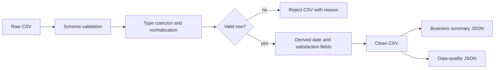

# Supermarket Sales ETL

A reproducible data-engineering implementation of the DEPI supermarket assignment. The original notebook and brief remain in `assignment panda/`; the production path is the tested Python package in `src/supermarket_etl`.

## Problem

The source CSV contains inconsistent categorical values, missing dates and prices, and duplicate invoice identifiers. Direct notebook analysis silently mixes those problems into business totals. This pipeline separates rejected records, records every quality decision, and computes the requested metrics only from validated transactions.

## Architecture



The run is idempotent: the same input and configuration overwrite the same four outputs. A scheduler, warehouse, Spark, and database were intentionally not added—the source is a single 1,014-row file and has no incremental or multi-service workload to justify them.

## Quality rules

- Require the complete source schema before processing.
- Treat `invoice_id` as the transaction business key and reject later duplicates.
- Coerce numeric and date fields and reject rows missing critical values.
- Require quantity >= 1, non-negative prices/sales, and ratings from 0 to 10.
- Reconstruct a missing unit price from `cost_of_goods_sold / quantity` when both values are valid.
- Normalize category casing and the `E-wallet`/`Ewallet` spelling.
- Reconcile every accepted row so `cost_of_goods_sold + gross_income == sales` to four decimals.

## Verified run

Run on the committed dataset on 15 September 2026:

| Measure | Result |
|---|---:|
| Input rows | 1,014 |
| Accepted rows | 959 |
| Rejected rows | 55 |
| Duplicate invoice rows | 14 |
| Unit prices reconstructed | 24 |
| Revenue reconciliation failures | 0 |
| Total validated revenue | 306,565.21 |
| Average transaction value | 319.67 |
| Satisfied transactions | 50.26% |

These are measurements from the local pipeline run, not claims about production usage.

## Run locally

```bash
python -m venv .venv
source .venv/bin/activate  # Windows: .venv\Scripts\activate
python -m pip install -e ".[dev]"
supermarket-etl
```

Outputs are written to `data/processed/`:

- `supermarket_clean.csv`
- `supermarket_rejects.csv`
- `data_quality.json`
- `business_summary.json`

Use another source or destination with:

```bash
supermarket-etl --input path/to/source.csv --output-dir path/to/output
```

## Test and quality checks

```bash
pytest -q
ruff check src tests
ruff format --check src tests
```

GitHub Actions repeats linting, unit tests, and a full pipeline run on every push and pull request. Tests cover schema rejection, duplicate handling, missing critical values, payment normalization, reconciliation, and business aggregation.

## Repository map

```text
src/supermarket_etl/       reusable ingestion, validation, transformation, analytics
tests/                     deterministic unit and data-quality tests
assignment panda/          original assignment, source data, and notebook
.github/workflows/ci.yml   automated verification
pyproject.toml             package and tool configuration
```

## Limitations

- The dataset is a static teaching sample; no incremental ingestion is needed.
- Rejected rows preserve a reason but are not automatically corrected when the missing value cannot be inferred.
- City and branch are retained as independent source attributes because the dataset provides no authoritative mapping between them.
